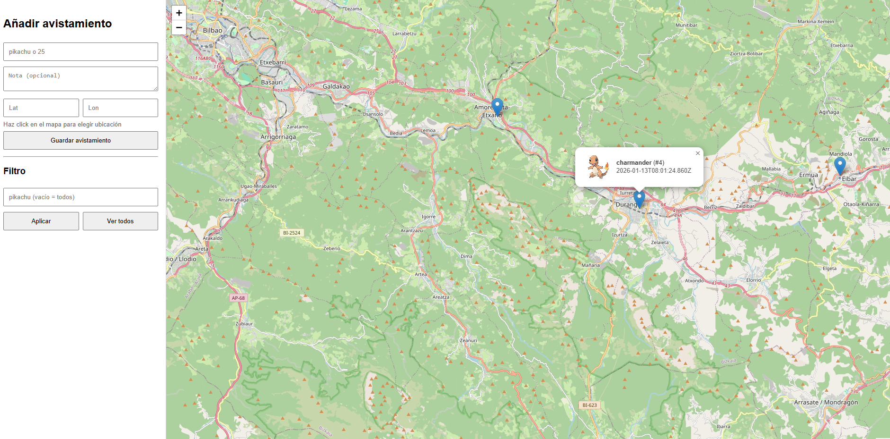

# 🗺️ PokéMap – Pokémon Begiztatzeen Web Aplikazioa

## 🎯 Proiektuaren helburua

PokéMap proiektuaren helburu nagusia **mapa interaktibo baten bidez Pokémonen begiztatzeen erregistroa eta horien bistaratzerako web aplikazio bat garatzea** da.

Erabiltzaileek mapan klik eginez Pokémon baten kokapena gorde dezakete, eta ondoren begiztatze guztiak **mapa berean ikusgai** geratzen dira.

---

## 📊 Datuen iturria

Pokémonen informazioa lortzeko **PokeAPI** erabili da.

- Webgunea: https://pokeapi.co  
- API publikoa eta doakoa  
- Pokémonen izenak, informazio orokorra eta bestelako datuak eskuratzeko erabiltzen da  

Lokalizazioa erabiltzaileak berak txertatzen du (mapan klik eginez edo koordenatuak sartuz).

### ⚠️ Ohar garrantzitsua (Unibertsitateko sarea)

Unibertsitateko sareak **HTTPS trafikoa ikuskatzen du**, eta horrek **PokeAPI-ra konexio seguruak blokeatzen ditu**.

Horregatik:
- Aplikazioa **sare arruntetan** (etxea, datu mugikorrak…) normaltasunez funtzionatzen du  
- Unibertsitateko sarean **kanpoko APIetarako konexioak mugatuta** daude  

Arazo hau **ez da aplikazioaren kodearena**, sare-azpiegiturarena baizik.

---

## 🛠️ Erabilitako teknologiak

### Backend

- Java 21  
- Maven  
- Spring Boot 3.x  
- REST API arkitektura  
- SQLite datu-base lokala (fitxategi bakarrean)

### Frontend

- HTML5  
- CSS  
- JavaScript  
- Leaflet (mapa interaktiboak)

---

## 🗄️ Datu-basea (SQLite)

Aplikazioak **SQLite** erabiltzen du Pokémonen begiztatzeak gordetzeko.

- Datu-basea automatikoki sortzen da aplikazioa lehen aldiz exekutatzean  
- Begiztatze bakoitzak honako informazioa gordetzen du:
  - Pokémonaren izena  
  - Latitudea eta longitudea  
  - Data eta ordua (timestamp)  
  - Oharra (aukerakoa)

### Zergatik SQLite?

- Konfigurazio sinplea duelako  
- Zerbitzari berezirik behar ez duelako  
- Proiektu akademiko baterako arina eta eraginkorra delako  

---

## 🧩 Aplikazioaren funtzionamendua

1. Erabiltzaileak web aplikazioa irekitzen du  
2. Mapan klik egiten du kokapen bat aukeratzeko (edo koordenatuak idazten ditu)  
3. Pokémon baten izena sartzen du  
4. Begiztatzea datu-basean gordetzen da  
5. Markatzailea mapan automatikoki bistaratzen da  

---

## 🐞 Akatsak eta mugak

Hasiera batean, **JavaFX** teknologia erabiliz frontend-a garatzea zen asmoa.

Probak egin ondoren, ikusi zen **JavaFX ez zela aukera egokia** mapen karga eta kudeaketa eraginkorra egiteko; horregatik, **web aplikazio baten aldeko apustua** egin da.

---

